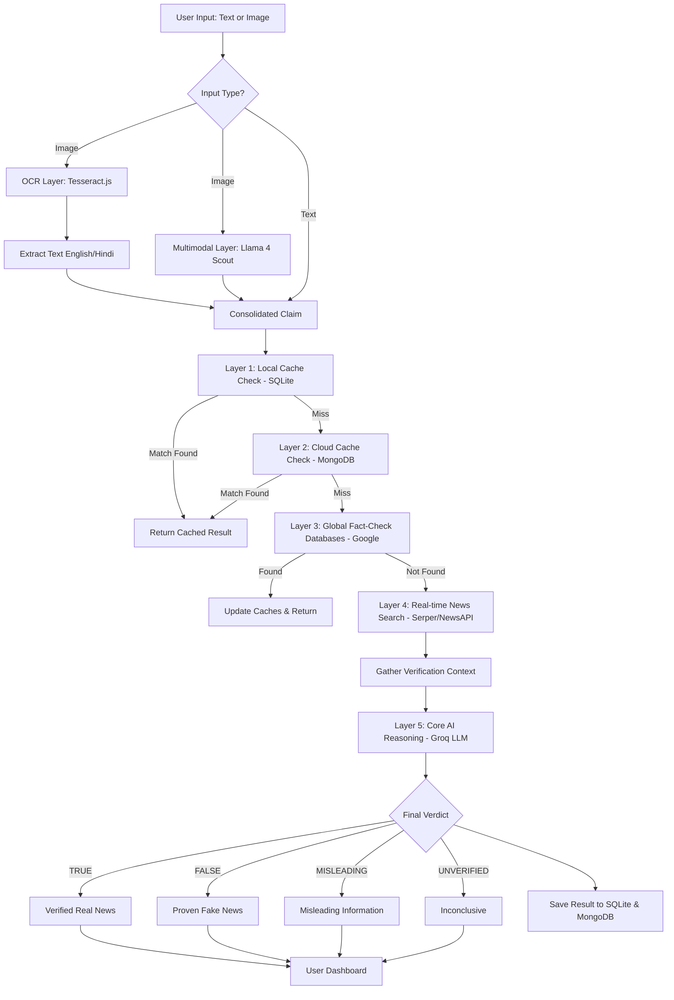

# Fake News Detector: Data Flowchart

This document contains the sequence of operations for the AI Fake News Detector, from user input to the final verdict.

## Technical Flowchart

```mermaid
graph TD
    A[User Input: Text or Image] --> B{Input Type?}
    
    B -- Image --> C[OCR Layer: Tesseract.js]
    C --> D[Extract Text English/Hindi]
    B -- Image --> E[Multimodal Layer: Llama 4 Scout]
    
    D --> F[Consolidated Claim]
    E --> F
    B -- Text --> F
    
    F --> G[Layer 1: Local Cache Check - SQLite]
    G -- Match Found --> H[Return Cached Result]
    G -- Miss --> I[Layer 2: Cloud Cache Check - MongoDB]
    
    I -- Match Found --> H
    I -- Miss --> J[Layer 3: Global Fact-Check Databases - Google]
    
    J -- Found --> K[Update Caches & Return]
    J -- Not Found --> L[Layer 4: Real-time News Search - Serper/NewsAPI]
    
    L --> M[Gather Verification Context]
    M --> N[Layer 5: Core AI Reasoning - Groq LLM]
    
    N --> O{Final Verdict}
    O --> |TRUE| P[Verified Real News]
    O --> |FALSE| Q[Proven Fake News]
    O --> |MISLEADING| R[Misleading Information]
    O --> |UNVERIFIED| S[Inconclusive]
    
    O --> T[Save Result to SQLite & MongoDB]
    P --> U[User Dashboard]
    Q --> U
    R --> U
    S --> U
```
